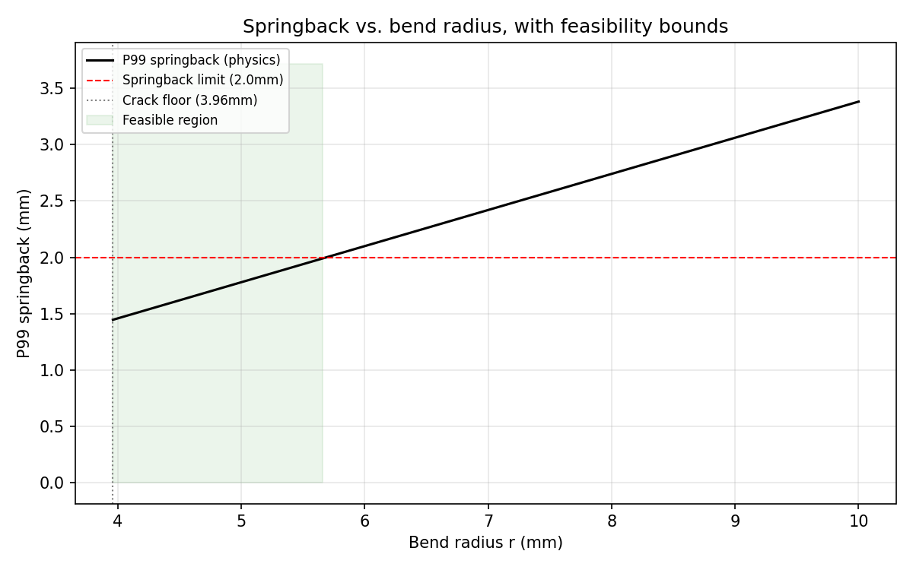
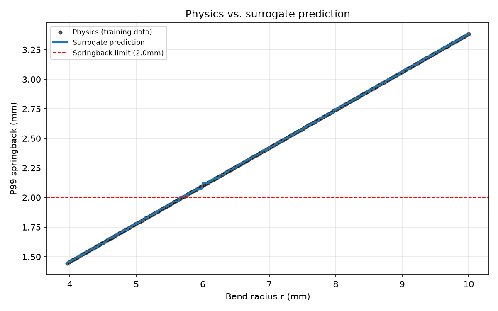
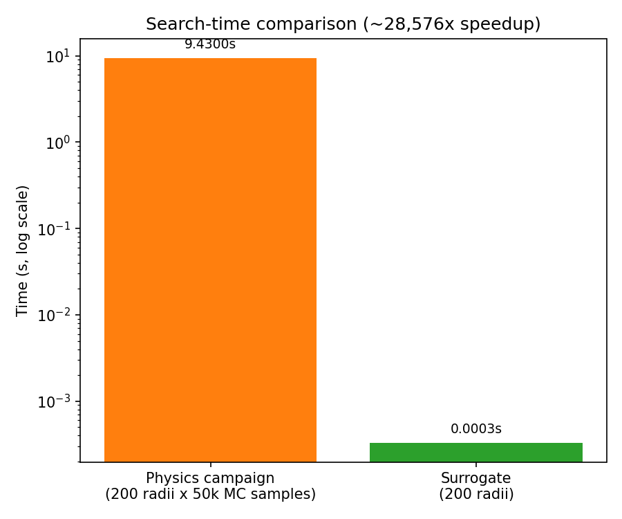

 AI Springback Optimization

## Problem

Given a 50 mm flange in nominal 1.2 mm sheet steel, find the **maximum bend radius** `r` such that:

- `r ≥ 3 × t_max` for crack avoidance
- flange-tip springback ≤ 2.0 mm (default but accepts alternative)
- thickness varies by ±10% (default but accepts alternative)
- yield strength varies by ±5% (default but accepts alternative)
- uncertainty is evaluated using Monte Carlo sampling

The objective is deliberately formulated as a constrained engineering optimization problem rather than a simple parameter sweep.

---

## How to run

### 1. Install

git clone https://github.com/IonPostolache/ai-springback-optimization.git
cd ai-springback-optimization

python -m venv .venv
source .venv/bin/activate

pip install -e .

### 2. Run the end-to-end demo
python run_demo.py

The demo:

Parses the engineering requirement into a structured specification.
Runs the robust optimization search using the physics evaluator.
Generates the corresponding parametric CAD geometry with build123d.
Exports the final design as a STEP file.
Generates an engineering explanation of the result.

Generated outputs are written to:
outputs/
├── cad/
│   └── final_flange_r*.step
└── ...

### 3. Run the tests
pytest

### 4. Run individual components

Generate example CAD geometries:
python cad/flange.py

Generate surrogate training data:
python surrogate/generate_training_data.py

Train the surrogate model:
python surrogate/train_surrogate.py

Generate plots:
python plots/make_plots.py

Test the LLM connection:
python llm/client.py

### 5. Run the complete end-to-end demo
python run_demo.py

## Architecture

Natural-language engineering requirement
                  │
                  ▼
          LLM intent parser
                  │
                  ▼
        Structured engineering spec
                  │
                  ▼
        Robust optimization search
                  │
          ┌───────┴────────┐
          ▼                ▼
   Physics evaluator   Surrogate evaluator
          │                │
          └───────┬────────┘
                  ▼
          Final candidate
                  │
                  ▼
       Parametric build123d CAD
                  │
                  ▼
              STEP export
                  │
                  ▼
          LLM result explainer

The LLM is intentionally kept at the edges of the system. It does not propose optimization candidates, modify the physics model, or decide whether a design is feasible.

### Validated physics

- **Model:** standard textbook elastic springback-ratio formula, `Ks = R_i/R_f = 4x³-3x+1` where `x = R_i·σy/(E·t)` — (Marciniak/Duncan/Hu, Boljanovic).
- **Cross-checked** against an independent through-thickness-integration model: both models exhibit the same monotonic trend and direction, with an approximately constant ~0.57 scaling difference. This provides an independent sanity check of the implemented relationship, but does not constitute validation against experimental data or production FEA.
- **Crack floor:** `r ≥ 3×1.32mm = 3.96mm` (correctly uses worst-case *thick* end).
- **Springback crossing:** confirmed numerically at **r≈5.5-5.7mm** — comfortably above the crack floor, a genuinely non-trivial search, not dominated by either constraint trivially.

CAD Generation
The flange is generated parametrically using build123d.

Robust Optimization

The search starts from the physically determined crack-avoidance floor and evaluates candidate radii using the deterministic Evaluator interface.
Each evaluation records:
bend radius
P99 springback
maximum sampled springback
constraint status
evaluator source
runtime
geometry hash
This provides a traceable optimization history rather than an opaque "AI found this value" result.

Surrogate Model

A machine-learning surrogate can approximate:
bend radius → P99 springback
using data generated by the physics evaluator.
The surrogate is evaluated against held-out physics evaluations using metrics such as R² and MAPE.
The surrogate is an engineering acceleration mechanism, not the source of physical truth. Final candidates are validated against the physics evaluator.
This parameter-vector surrogate should not be confused with geometry-native deep-learning approaches used in industrial CAE workflows.

LLM Integration

The LLM has two narrowly defined responsibilities:
Front edge
Convert a natural-language engineering requirement into a validated structured specification.
Back edge
Explain the optimization result using the numerical results produced by the deterministic pipeline.
The LLM is deliberately excluded from the optimization loop and physics evaluation.
This prevents language-model variability from determining engineering feasibility.
The current implementation uses an OpenAI-compatible local LLM endpoint through LM Studio/LM Link, keeping the workflow local and avoiding dependency on a cloud inference API.

Validation and Limitations

This project is a workflow demonstrator, not a production stamping solver.

## Results

For the nominal requirement:

- Sheet thickness: 1.2 mm
- Thickness uncertainty: ±10%
- Yield-strength uncertainty: ±5%
- Springback limit: 2.0 mm
- Objective: maximize bend radius

the robust search converges to:

| Metric | Result |
|---|---:|
| Maximum feasible radius | 5.706 mm |
| P99 springback | 1.9992 mm |
| Crack constraint | Pass |
| Search iterations | 9 |
| Monte Carlo samples/evaluation | 500 |
| Automated tests | 21/21 passed |

### Surrogate performance

The surrogate was trained on 200 physics campaigns, using 160 samples for training and 40 held out for testing.

| Metric | Result |
|---|---:|
| Held-out R² | 0.99953 |
| Held-out MAPE | 0.4442% |
| Training time | 0.025 s |
| 200-radius surrogate prediction | 0.24 ms |
| 200-radius physics campaigns | ~9.4 s |

### Optimization result

The plot shows the relationship between bend radius and predicted P99 springback,
with the feasible region bounded by the springback constraint.

### Physics model vs surrogate

The surrogate closely reproduces the physics evaluator over the sampled radius range,
with a held-out R² of 0.99953 and MAPE of 0.4442%.

### Evaluation speed

The surrogate provides a substantial reduction in evaluation time, making it suitable
for accelerating candidate exploration before verification with the physics evaluator.

---

## Day-by-day plan

**Day 1 — CAD + typed interfaces.** build123d parametric flange (fixed 50mm length, variable radius `r`), STEP export, geometry validation, geometry hash. `DesignParameters`/`EvaluationResult` dataclasses, `Evaluator` protocol with `mode="physics"/"surrogate"` stub from the start.

**Day 2 — Physics evaluator + Monte Carlo campaign.** Implement `evaluate_springback` (already validated above) as `PhysicsEvaluator.evaluate(r)`: sample N draws (start ~200-500) over thickness (±10%) and yield strength (±5%), return P99 and max springback. This is your honest per-radius cost.

**Day 3 — Search loop.** Simple bisection/scan over `r`, starting at the crack floor, using the physics evaluator. Log every candidate: `r, P99_springback, max_springback, feasible, geometry_hash`. Rejected/infeasible candidates get a suggested-fix message (vcad-style: "SpringbackExceedsLimit at r=5.0mm → try r≥5.6mm").

**Day 4 — LLM at the edges.** Front: parse "find the maximum bend radius keeping springback under 2mm across ±10% thickness variation" into structured constraints JSON. Back: explain the final result from logged numbers only. No LLM inside the search.

**Day 5 — Robustness pass.** Repeated runs, edge-case radii, confirm the bisection converges cleanly and rejected-candidate logging is complete.

**Day 6 — Surrogate + validation reporting.** Generate training data (`r → P99` pairs from campaigns across the search range), train a small regressor (GradientBoosting or similar), report R²/MAPE against held-out physics evaluations. Plot: springback vs. radius (physics vs. surrogate overlay), campaign-time vs. surrogate-time comparison using your actual measured numbers.

**Day 7 — README.** Task statement up top. PLM interface-contract framing. Manual-vs-automated timing. Stop-condition rationale. Rejected-candidates examples. Data-provenance sentence. Precise surrogate-honesty paragraph (parameter-vector surrogate vs. NC's geometry-native deep learning). Citations to LaDEEP/DDACS/ENSIMA as evidence this problem class is real. One line on why you chose closed-form physics over full FEA (execution-risk trade-off for a one-week solo build, workflow pattern transfers).

**Week 2 (optional, additive only):** active-learning refinement, small API boundary, visualization polish — in that priority order, only if week 1 finishes early.
